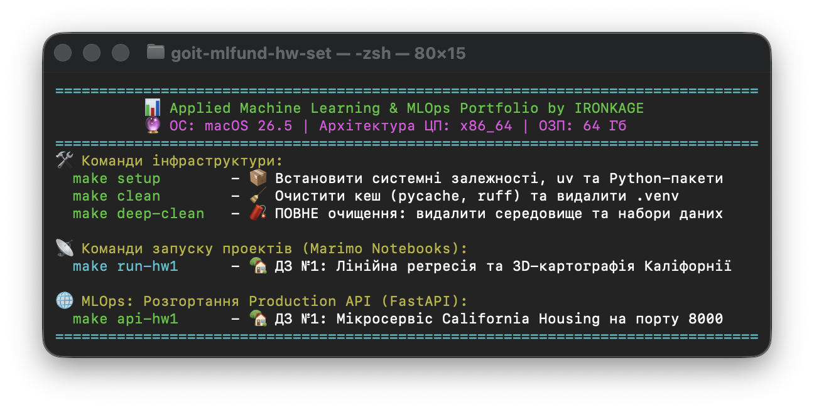

# goit-mlfund-hw-set

## 👾 Applied Machine Learning & MLOps Portfolio

[](https://opensource.org/licenses/MIT) [](https://docs.python.org/3.12/) [](https://docs.astral.sh/uv/) [](https://www.gnu.org/software/make/)

**Студент:** Oleh Hatsenko | **Курс:** GoIT Neoversity Master of Science in AI/ML

Це репозиторій-портфоліо інженерних навичок у сфері Data Science, Machine Learning та MLOps.

Проект побудований з акцентом на **Clean Architecture**, оптимізацію пам'яті (Copy-on-Write) та сучасні індустріальні стандарти станом на червень 2026 року. Усі ноутбуки розроблені в реактивному середовищі Marimo.

За основу взяті ***Домашні Роботи і Фінальний Проект*** з **Machine Learning: Fundamentals and Applications** та вдосконалені до рівня ***FAANG/MAAMA/MANGO***.

---

## 🛠 Технологічний Стек (Bleeding Edge)

У проекті використовуються строго зафіксовані версії бібліотек, які гарантують стабільність, відсутність витоків пам'яті (VRAM) та підтримку найновіших індустріальних практик:

### 🎨 Core Frameworks & UI

- [](https://pypi.org/project/marimo/0.23.11/) 🔸 Реактивне Python-середовище нового покоління (заміна Jupyter)
- [](https://pypi.org/project/ipysigma/0.24.6/) 🔸 WebGL-рушій для рендерингу складних інтерактивних графів
- [](https://pypi.org/project/streamlit/1.58.0/) 🔸 Фреймворк для розгортання BI-дашбордів
- [](https://pypi.org/project/plotly/6.8.0/) 🔸 Інтерактивна багатовимірна візуалізація та аналіз залишків

### 💾 Data Engineering (Memory Optimized)

- [](https://pypi.org/project/pandas/2.3.3/) 🔸 Стабільна LTS-гілка з підтримкою `PyArrow` та `Copy-on-Write` (оптимізація RAM)
- [](https://pypi.org/project/pyarrow/24.0.0/) 🔸 Високопродуктивний бекенд пам'яті для Pandas (на базі C++ Apache Arrow)
- [](https://pypi.org/project/polars/1.42.1/) 🔸 Надшвидкий рушій (Rust). Нативний стандарт для UI-таблиць Marimo
- [](https://pypi.org/project/numpy/1.26.4/) 🔸 LTS-версія для збереження ABI-сумісності C++ компіляторів на старих архітектурах macOS (Intel/AMD)
- [](https://pypi.org/project/scipy/1.16.3/) 🔸 "Мостова" версія: сумісна зі старим NumPy 1.x та задовольняє суворі вимоги профайлера
- [](https://pypi.org/project/fg-data-profiling/4.19.1/) 🔸 Автоматичний розвідувальний аналіз (EDA) та Data Drift (колишній ydata-profiling)
- [](https://pypi.org/project/tqdm/4.68.3/) 🔸 Моніторинг прогресу виконання важких циклів та завантажень (CLI/GUI)
- [](https://pypi.org/project/gdown/6.1.0/) 🔸 Утиліта для прямого атомарного завантаження великих наборів даних з Google Drive

### 🧠 Machine Learning Algorithms

- [](https://pypi.org/project/scikit-learn/1.9.0/) 🔸 Використовується нативний Pandas API (`transform_output="pandas"`)
- [](https://pypi.org/project/xgboost/3.3.0/) 🔸 Екстремальний градієнтний бустинг із нативною підтримкою категоріальних ознак
- [](https://pypi.org/project/lightgbm/4.6.0/) 🔸 Високопродуктивний градієнтний бустинг від Microsoft (енсемблінг)
- [](https://pypi.org/project/interpret/0.7.8/) 🔸 Explainable Boosting Machine (EBM) для глибокої інтерпретації прийняття рішень
- [](https://pypi.org/project/imbalanced-learn/0.14.2/) 🔸 Інженерія дисбалансу класів (SMOTE, ADASYN)
- [](https://pypi.org/project/prophet/1.3.0/) 🔸 SOTA-алгоритм від Meta для прогнозування часових рядів

### ⚙️ MLOps & Tracking

- [](https://pypi.org/project/mlflow/3.14.0/) 🔸 Інфраструктура для логування експериментів, параметрів та серіалізації моделей
- [](https://pypi.org/project/joblib/1.5.3/) 🔸 Оптимізоване збереження пайплайнів машинного навчання
- [](https://pypi.org/project/optuna/4.9.0/) 🔸 Просунутий фреймворк для Байєсівської оптимізації гіперпараметрів (Smart Tuning)

### 🤖 Foundation Models (Zero-Shot)

- [](https://pypi.org/project/torch/2.12.1/) 🔸 Фундаментальний рушій обчислень із **динамічним апаратним маршрутизатором** (CUDA/MPS/XPU). Для збереження стабільності на **Legacy macOS (Intel x64 + AMD)** автоматично розгортається: [](https://pypi.org/project/torch/2.2.2/)
- [](https://pypi.org/project/timesfm/2.0.1/) 🔸 Універсальна Zero-Shot модель від Google Research для прогнозування часових рядів (на базі архітектури Transformer)
- [](https://pypi.org/project/sentence-transformers/5.6.0/) 🔸 SOTA-моделі для генерації щільних семантичних векторних ембеддінгів (RAG, кластеризація та NLP)

### 🛰️ Model Serving & API (Production)

- [](https://pypi.org/project/fastapi/0.138.0/) 🔸 Сучасний асинхронний фреймворк для створення ML API
- [](https://pypi.org/project/uvicorn/0.49.0/) 🔸 Блискавичний ASGI-сервер для запуску FastAPI-додатків
- [](https://pypi.org/project/pydantic/2.13.4/) 🔸 Сувора валідація вхідних даних (JSON) для моделей машинного навчання
- [](https://github.com/scalar/scalar) 🔸 Сучасний CDN-бекенд для рендерингу OpenAPI документації з вбудованим клієнтом

---

## 📂 Архітектура та проекти

```text
goit-mlfund-hw-set/              
│
├── .venv/                      # 🐍 Ізольоване віртуальне середовище (генерується автоматично через uv)
│
├── core/                       # 🧠 Ядро (Інфраструктура, спільна для всіх проектів)
│   ├── __init__.py             # ⚙️ Фасад API, ініціалізація логування та MLflow трекінгу
│   ├── datasets.py             # 🛟 Локальні генератори даних (Fallback-стратегія)
│   ├── etl_core.py             # 🧬 Інтелектуальний 5-рівневий завантажувач (Kaggle/GDrive/API)
│   └── ml_utils.py             # 💠 Динамічний маршрутизатор заліза (CUDA/MPS/XPU та інші) та Garbage Collector
│
├── data/                       # 💾 Єдина папка для сирих та оброблених даних всіх проектів
│   └── .gitkeep                # ⚠️ Маркер для збереження директорії у системі контролю версій Git
│
├── hw_01_california/           # 🏡 Проект 1: California Housing
│   ├── hw_01_linreg.py         # 📒 Marimo-ноутбук (Auto-EDA, DBSCAN гео-кластеризація, Top-30 Benchmark, Optuna тюнінг, 3D Бонсай)
│   ├── ui_labels.py            # 🇺🇦 Словники перекладів та мапінгу ознак (для SHAP та UI)
│   └── README.md               # 📜 Опис завдання до модуля "Алгоритми навчання з вчителем Ч.1" та Висновки
│
├── img/                        # 🖼️ Зображення та ассети для документації репозиторію
│
├── mlruns/                     # 🗄️ База даних експериментів та реєстр моделей (MLflow Tracking)
│   └── mlruns.db               # 🗃️ SQLite сховище метрик (MAE, R2), параметрів Optuna та версій моделей
│
├── models/                     # 🤖 Єдине сховище для серіалізованих ML-пайплайнів та артефактів
│   ├── california_housing/         # 📦 Ізольована капсула для мікросервісу під Проект 1
│   │   ├── api.py                  # 🚀 Артефакт: Згенерований FastAPI-мікросервіс із Scalar UI
│   │   ├── features_schema.json    # 📝 Артефакт: Маніфест типів даних (Бронежилет бекенду)
│   │   └── [model]_champion.joblib # 🧠 Артефакт: Ваги оптимізованої моделі
│   ├── .gitkeep                    # ⚠️ Маркер для збереження директорії у Git (самі моделі ігноруються)
│   └── hw01_california_housing_eda.html # 📊 Звіт розвідувального аналізу даних (Auto-EDA) під Проект 1
│
├── etl_pipeline.log            # 📝 Логи виконання процесів екстракції та трансформації даних
├── .editorconfig               # 📝 Стандарти форматування коду для командної розробки
├── .env                        # 🔐 Локальні змінні середовища (креденшнли, конфіги — ігнорується Git)
├── .env.example                # 📄 Безпечний шаблон змінних середовища для розгортання на нових машинах
├── .gitignore                  # 🚫 Правила ігнорування файлів (кеші, бази SQLite, .joblib моделі, CSV-наборами даних)
├── LICENSE                     # ⚖️ Ліцензія відкритого вихідного коду (MIT)
├── Makefile                    # 🪄 Головний MLOps оркестратор (Zero-Config Deployment)
├── README.md                   # 📖 Головна архітектурна документація проекту
└── requirements.txt            # 📦 Точно зафіксовані залежності Python (PEP 508 сумісні v2026.06)
```

- **Core Інфраструктура (`/core`):** Відокремлене від ноутбуків системне ядро. Відповідає за інтелектуальну маршрутизацію апаратного забезпечення, безпечне атомарне завантаження даних (захист від битих архівів, 416 помилок та API Rate Limits ), а також забезпечення 100% відтворюваності експериментів (Global Seed)
- [**California Housing (`HW 01`):**](./hw_01_california/README.md) Комплексний ML- пайплайн для прогнозування вартості нерухомості. Включає просторову кластеризацію (`DBSCAN`), енсемблінг (`XGBoost`, `LightGBM`), перевіряючи гіпотези на гомоскедастичність залишків, байєсівську оптимізацію гіперпараметрів (`Optuna`), 3D візуалізацію дерев рішень засобами *WebGL* та автоматичну MLOps-серіалізацію у **FastAPI мікросервіс** із суворими Pydantic-контрактами та інтегрованою OpenAPI документацією через **Scalar**.

## 🪬 Швидкий старт



Проект має Zero-Dependency Boot. Достатньо мати встановлений [Python](https://www.python.org/downloads/) і [GNU Make](https://www.gnu.org/software/make/), та у *Терміналі* написати:

```bash
make
```
