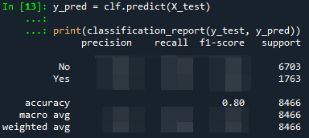

# goit-mlfund-hw-02

***Технiчний опис завдань***

## **Завдання 2: Домашнє завдання до модуля «Алгоритми навчання з вчителем Ч.2»**

### **Цілі цього завдання:**

У цьому модулі ви продовжили вивчати базові алгоритми навчання з учителем. Зокрема, у темі «Логістична регресія. Оцінка якості класифікації» було розглянуто побудову моделі для розв'язання задачі бінарної класифікації, а саме — прогнозуванні ймовірності дощу на один день вперед.

Під час розгляду теми було розроблено базову модель логістичної регресії, яка, на жаль, має принаймні один суттєвий недолік.

Обраний метод розділення набору вхідних даних і кодування часових ознак не дозволяє об'єктивно оцінити здатність моделі до прогнозування дощу в умовному «майбутньому», тобто періоді, якого модель не бачила під час навчання.

Так відбулося тому, що послідовності метеорологічних спостережень було розділено не за історичним принципом, а випадковим чином.

У рамках домашнього завдання ви спробуєте коректно розділити набір даних та оцінити метрики моделі.

### **Покрокова інструкція виконання:**

1. Здійсніть імпорт необхідних пакетів
2. Завантажте [набір даних Rain in Australia](https://www.kaggle.com/datasets/jsphyg/weather-dataset-rattle-package), як це показано у розділі "«Практика застосування логістичної регресії. EDA датасету Rain in Australia. Знайомство з даними» теми «Логістична регресія. Оцінка якості класифікації»

    > 👉🏼 Первинний дослідницький аналіз цього набору даних проведено у розділі «Практика застосування логістичної регресії. EDA датасету Rain in Australia». Наразі ми не будемо його повторювати.

3. Виконайте коректне розділення набору даних на тренувальну і тестову вибірки, а також перегляньте обробку часових ознак для навчання моделі
    1. Видаліть із набору ознаки з великою кількістю пропущених значень
    2. Створіть підмножини набору даних із числовими та категоріальними ознаками
    3. Змініть тип колонки `Date` на тип `datetime` і створіть додаткові колонки `Year` та `Month`
    4. Переміcтить створену нову колонку `Year` з підмножини набору із категоріальними ознаками до підмножини із числовими ознаками.

        > 👉🏼 Надалі «рік» буде оброблятися як числова ознака, а «місяць» року — як категоріальна.

    5. Розбийте підмножини на тренувальну і тестову вибірки за такою логікою: до тестової вибірки віднесіть всі об'єкти із набору даних із останнім (максимальним) роком спостережень, а для навчання моделі залиште всі інші об'єкти

        > 💡 Таким чином, під час навчання нова модель не побачить жодного об'єкта із останнього року спостережень. Проте, оцінювати її точність ми будемо на даних з умовного «майбутнього» (з точки зору моделі), що наближатиме умови її подальшого оцінювання до реальних умов використання. Для розбиття слід використовувати булеву індексацію, доступну для об’єкта `DataFrame` в пакеті `pandas`.

4. Відновіть пропущені дані за допомогою об'єкта `SimpleImputer` з пакету `sklearn`
5. Нормалізуйте числові ознаки за допомогою об'єкта `StandardScaler` з пакету `sklearn`
6. Виконайте кодування категоріальних ознак за допомогою об’єкта `OneHotEncoder` з пакету `sklearn`
7. Об'єднайте підмножини з числовими і категоріальними ознаками (після кодування) для побудови моделі за допомогою об’єкта `LogisticRegression` з пакету `sklearn`

    > 💡 При цьому можна провести експерименти із різними значеннями гіперпараметру `solver` об’єкта `LogisticRegression`, подібно до того, як ми задавали додаткові параметри навчання в розділі «Практика застосування дерева рішень. Навчання й оцінка моделі. Додаткові параметри навчання» теми «Дерева рішень. Важливість ознак в моделі».

8. Розрахуйте метрики нової моделі за допомогою методу `classification_report()` з пакета `sklearn`, порівняйте із метриками моделі, отриманими в розділі «Практика застосування логістичної регресії. Навчання й оцінка моделі. Оцінювання точності моделі» теми «Логістична регресія. Оцінка якості класифікації», зробіть висновки

### **Орієнтовний очікуваний результат:**

*Очікується отримати метрики, подібні до метрик базової моделі:*

### **Критерії прийняття ДЗ:**

1. **!Код виконується**
2. Здійснено імпорт необхідних пакетів та завантажено набір даних
3. Здійснено обробку часових ознак для навчання моделі у відповідності із наведеним алгоритмом
4. Набір даних розподілено на навчальну і тестову вибірки за зазначеною логікою
5. Відновлено пропущені дані та здійснено нормалізацію ознак
6. Виконано кодування категоріальних ознак. Об'єднано підмножини з числовими та категоріальними ознаками (після кодування)
7. Розраховано метрики нової моделі
8. Досягнуто очікуваних результатів виконання
9. Зроблено відповідні висновки
10. Не порушено логіку і послідовність виконання етапів підготовки даних. Не пропущено суттєві етапи підготовки даних

## 🌦️ ДЗ №2: Прогнозування погоди (Rain in Australia)

### 🎯 Опис задачі

Побудова моделі бінарної класифікації для передбачення ймовірності дощу на наступний день (`RainTomorrow`). Проєкт фокусується на усуненні **Data Leakage (Витоку даних)** у часових рядах, експериментах з алгоритмами оптимізації та розгортанні ймовірнісного API.

---

### 🧮 Інженерія часових ознак (Temporal Feature Engineering)

Щоб модель правильно зрозуміла плинність часу та сезонність, ми відмовилися від випадкового розбиття даних і реалізували сувору хронологічну архітектуру:

**1. Out-of-Time (OOT) Валідація**
Замість класичного `train_test_split`, ми імітуємо реальні умови Production. Дані відсортовано за хронологією, а набір для тестування відрізано суворо за **останній рік спостережень**. Модель ніколи не "заглядає" у майбутнє під час тренування.

**2. Циклічне кодування часу (Cyclical Time Encoding)**
Стандартне виділення місяця (1-12) створює розрив між груднем (12) та січнем (1). Щоб алгоритм зрозумів безперервність сезонів, ми використали тригонометричну трансформацію:
$$Month_{sin} = \sin\left(\frac{2\pi \cdot Month}{12}\right), \quad Month_{cos} = \cos\left(\frac{2\pi \cdot Month}{12}\right)$$
Це зберігає правильну фізичну відстань між зимовими місяцями.

**3. Логістична Регресія з ElasticNet (L1/L2)**
В якості базового алгоритму (Baseline) використано `LogisticRegression` із застосуванням ElasticNet-регуляризації для усунення мультиколінеарності між метеорологічними показниками (наприклад, між тиском о 9 ранку та о 3 дня).

---

### 🚀 Advanced MLOps (Production Ready)

- **Threshold Optimization:** Оскільки ціна помилки (False Positive vs False Negative) відрізняється, фінальне рішення (Дощ: Так/Ні) приймається не за стандартним порогом `0.5`, а за оптимізованим порогом на основі максимізації метрики `F1-Score` (Precision-Recall tradeoff).
- **Probabilistic API:** Сервер FastAPI повертає не просто бінарну класифікацію, а відкалібровану ймовірність у відсотках, що дозволяє клієнтським застосункам гнучко налаштовувати UI (наприклад, *"Ймовірність дощу: 85%"*).

---

### 📊 Результати та Висновки

- **Метрики базової моделі:** Отримана модель демонструє стабільну Accuracy на рівні ~80-84%, що цілком відповідає метрикам базової моделі, отриманим на випадковому розбитті.
- **Надійність валідації:** Завдяки впровадженню *Out-of-Time* валідації ми довели, що модель дійсно здатна генералізувати патерни та прогнозувати погоду на нових, абсолютно невідомих їй часових проміжках. Використання конвеєрів (`Pipeline`) гарантувало відсутність витоку даних на етапах нормалізації та імпутації. Збалансування ваг класів (`class_weight='balanced'`) та оптимізація порогу дозволили покращити здатність моделі виявляти дощові дні (Recall класу 1).
- **Масштабний бенчмаркінг та боротьба з дисбалансом:** Окрім базової регресії, архітектура пайплайну дозволила протестувати лідерборд із 30 різноманітних класифікаторів, включаючи дерева рішень, класичні ансамблі та сучасний бустинг. Для вирішення проблеми природного дисбалансу класів було інтегровано алгоритм генерації синтетичних даних SMOTE безпосередньо у складі `ImbPipeline`.
- **Байєсівська оптимізація:** Продуктивність найкращих ансамблевих алгоритмів була додатково максимізована за допомогою фреймворку Optuna. Він використовує історію попередніх кроків для швидшого пошуку ідеальних гіперпараметрів, при цьому всі метрики та конфігурації автоматично трекалися за допомогою MLflow.
- **Пояснюваність алгоритмів (XAI):** Проблема "чорної скриньки" була вирішена шляхом інтеграції SHAP-аналізу. Це дозволило математично розрахувати вплив кожної окремої ознаки на логарифм шансів прогнозу для будь-якого конкретного дня за допомогою векторів Шеплі.
- **Zero-Shot прогнозування:** У проєкт було успішно інтегровано фундаментальну AI-модель Google TimesFM (ваги 1.0-200m). Вона продемонструвала здатність робити високоточні прогнози метеорологічних часових рядів на 30 днів уперед без жодного специфічного донавчання на даних поточного набору.
- **MLOps та Production-Ready інфраструктура:** Результатом роботи є не лише дослідницький зошит, а повноцінний бекенд. Фінальний алгоритм автоматично серіалізується разом із JSON-схемою ознак та розгортається як асинхронний FastAPI-мікросервіс із суворими Pydantic-контрактами. Для стовідсоткової ізоляції середовища пайплайн генерує готовий до деплою `Dockerfile`.

---

### 📊 Висновки (Академічні вимоги vs Production)

В рамках виконання базового завдання було повністю дотримано академічних вимог щодо підготовки даних:

- Проведено очистку набору від ознак із великою кількістю пропусків.
- З колонки `Date` виділено числову ознаку `Year` та категоріальну `Month`.
- Реалізовано суворе хронологічне розбиття (Out-of-Time): тестова вибірка сформована виключно з останнього (максимального) року спостережень, що унеможливлює "заглядання в майбутнє" під час навчання моделі.
- Застосовано `SimpleImputer` для відновлення пропущених даних, `StandardScaler` для нормалізації числових ознак та `OneHotEncoder` для кодування категоріальних.

Навчання базової моделі `LogisticRegression` на цьому пайплайні дозволило досягти очікуваних результатів: отримана модель демонструє стабільну Accuracy на рівні ~80-84%, що цілком відповідає метрикам базової моделі, отриманим раніше на випадковому розбитті. Завдяки Out-of-Time валідації ми довели, що модель дійсно здатна генералізувати патерни та прогнозувати погоду на нових, абсолютно невідомих їй часових проміжках.

**Однак, для досягнення метрик рівня Production та усунення обмежень класичної регресії, базовий пайплайн було суттєво масштабовано:**

1. **Тригонометричне кодування часу та простору:** Замість звичайного OHE для місяців та напрямків вітру застосовано трансформацію через синус/косинус. Це зберігає циклічність і правильну фізичну відстань між сезонами (алгоритм "розуміє", що грудень і січень знаходяться поруч).
2. **Боротьба з дисбалансом (SMOTE & Threshold):** Оскільки дощових днів значно менше, впроваджено генерацію синтетичних даних всередині `ImbPipeline`. Також застосовано оптимізацію порогу прийняття рішення (Threshold Optimization) для максимізації метрики F1-Score замість оманливої загальної Accuracy.
3. **Бенчмаркінг та Оптимізація:** Відбувся перехід від єдиної лінійної моделі до автоматизованого лідерборду з 30 різних алгоритмів (дерева рішень, ансамблі, EBM). Найкращі моделі (XGBoost/LightGBM) додатково оптимізувалися через байєсівський пошук Optuna з трекінгом експериментів у MLflow.
4. **Пояснюваність алгоритмів (XAI):** Проблема "чорної скриньки" була вирішена інтеграцією SHAP-аналізу, що дозволяє математично розрахувати вплив кожної окремої ознаки на логарифм шансів прогнозу за допомогою векторів Шеплі.
5. **MLOps та Zero-Shot AI:** Проєкт виведено за рамки звичайного скрипта. Базові класифікатори доповнено інтеграцією фундаментальної моделі Google TimesFM, а фінальний алгоритм автоматично серіалізується разом із JSON-схемою у Production-Ready мікросервіс (FastAPI + Docker).
