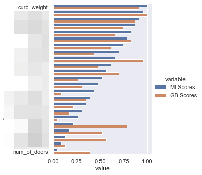

# goit-mlfund-hw-04

***Технiчний опис завдань***

## **Завдання 4: Домашнє завдання до модуля «Підходи до покращення якості»**

### **Цілі цього завдання:**

У цьому модулі ми розглядали методи підвищення ефективності прогнозних моделей, використовуючи їх об'єднання в ансамблі, та створюючи нові та/або трансформуючи доступні вхідні ознаки для підвищення їхньої інформативності.

Зокрема в темі «Вступ до генерації ознак. Відбір ознак» ми досліджували показник взаємної інформації, який дозволяє оцінити зв'язок між різними ознаками в наборі. Під час аналізу практичних прикладів виявилося, що навіть ознаки з низьким показником MI можуть залишатися достатньо «корисними» для подальшого моделювання.

У домашньому завданні ви звернетеся до набору даних про автомобілі (Autos) і побудуєте регресійну модель, щоб порівняти показники взаємної інформації між ознаками й цільовою змінною (mutual information) із показниками їх важливості для прогнозної моделі (feature importance).

### **Покрокова інструкція виконання:**

1. Завантажте набір даних Autos, як це показано в темі «Вступ до генерації ознак. Відбір ознак» в розділі «Поширені прийоми генерації ознак. Математичні перетворення»
    - **Mutual Information:** [toramky/automobile-dataset](https://www.kaggle.com/datasets/toramky/automobile-dataset)
    - **Decision Tree vs Random Forest:** [nehalbirla/vehicle-dataset-from-cardekho](https://www.kaggle.com/datasets/nehalbirla/vehicle-dataset-from-cardekho)
2. Визначте перелік дискретних ознак (в широкому розумінні) для подальшого розрахунку показника взаємної інформації
3. Розрахуйте показник взаємної інформації для вхідних ознак і цільової змінної `price` за допомогою методу `mutual_info_regression()` з пакета `sklearn`
4. Побудуйте регресійну модель / ансамбль (наприклад, за допомогою обєкта `RandomForestRegressor` або `GradientBoostingRegressor` з пакета `sklearn`) для ефективної оцінки важливості вхідних ознак, подібно до того, як ми це робили у темі «Дерева рішень. Важливість ознак в моделі» в розділі «Важливість ознак у моделі»

    > 💡 Для побудови моделі потрібно коректно виконати кодування категоріальних / дискретних ознак в наборі даних

5. Масштабуйте / уніфікуйте різні за своєю природою показники взаємної інформації та важливості ознак у моделі за допомогою методу `.rank(pct=True)` об’єкта `DataFrame` з пакета `pandas`

    > 💡 Деталі щодо використання методу дивіться на [сторінці документації](https://pandas.pydata.org/pandas-docs/stable/reference/api/pandas.DataFrame.rank.html)

6. Побудуйте візуалізацію типу [grouped barsplots](https://seaborn.pydata.org/examples/grouped_barplot.html) для порівняння обох наборів за допомогою методу `catplot()` з пакета `seaborn`

    > 💡 Для цього може знадобитися відповідним чином переформатувати дані за допомогою методу `.melt()` з пакета `pandas`

7. Проаналізуйте візуалізацію та зробіть висновки

### **Орієнтовний очікуваний результат:**

*«Корисність» окремих ознак з точки зору показника взаємної інформації може значно відрізнятися від їхньої важливості в моделі для прийняття рішень:*

### **Критерії прийняття ДЗ:**

1. **!Код виконується**
2. Завантажено набори даних
3. Визначено перелік дискретних ознак та правильно розраховано показник взаємної інформації для вхідних ознак і цільової змінної
4. Побудовано регресійну модель / ансамбль для оцінки важливості вхідних ознак
5. Масштабовано / уніфіковано показники взаємної інформації та важливості ознак у моделі
6. Побудовано візуалізацію, проаналізовано її та зроблено висновки
7. Досягнуто очікуваних результатів виконання
8. Зроблено відповідні висновки
9. Не порушено логіку і послідовність виконання етапів підготовки даних. Не пропущено суттєві етапи підготовки даних

## 🚗 ДЗ №4: Важливість ознак у моделях (Autos & CarDekho Pricing)

### 🎯 Опис задачі

Побудова регресійних моделей (одиночних дерев рішень та ансамблів) для прогнозування вартості автомобілів на базі наборів даних Autos та CarDekho. Головний фокус проєкту — дослідження "корисності" вхідних ознак шляхом прямого порівняння їхньої статистичної взаємної інформації (Mutual Information) із їхньою алгоритмічною важливістю у моделі (Feature Importance).

---

### 🧮 Математичне ядро: Інформаційна ентропія та Ансамблі

Для глибокого аналізу ознак реалізовано двофакторний підхід:

**1. Взаємна інформація (Mutual Information - MI)**
Оцінює статистичну залежність між кожною окремою ознакою $X$ та цільовою змінною $Y$ (ціною авто). Метод базується на теорії інформації Шеннона і вимірює зменшення невизначеності щодо $Y$, коли відомо $X$:

$$I(X; Y) = \int_Y \int_X p(x, y) \log\left(\frac{p(x, y)}{p(x)p(y)}\right) dx dy$$

MI розглядає кожну фічу ізольовано, не враховуючи її синергію з іншими змінними.

**2. Важливість ознак (Feature Importance)**
Ансамблеві алгоритми будують безліч дерев рішень. Важливість кожної ознаки розраховується як нормалізоване сумарне зменшення критерію інформативності (наприклад, MSE) в усіх вузлах, де ця ознака використовувалась для розгалуження:

$$\text{Importance}_j = \frac{\sum_{T} \sum_{t \in T: v(t)=j} \Delta i(t, t_L, t_R)}{\text{Total Number of Trees}}$$

На відміну від MI, дерева здатні фіксувати нелінійні взаємодії, але схильні ігнорувати дублюючі (висококорельовані) фічі.

**3. Уніфікація шкал (Percentile Ranking)**
Оскільки MI видає абсолютні значення (в бітах/натах), а фічі в ансамблях сумуються до 1.0, пряме порівняння в оригінальному вигляді неможливе. Застосовано метод ранжирування `.rank(pct=True)` з пакету `pandas`, який приводить обидві метрики до єдиної перцентильної шкали (від 0.0 до 1.0) для побудови коректного графіку.

---

### 🧪 Квантова пояснюваність та Байєсівська оптимізація

Проєкт інтегрує сучасні підходи до налаштування та пояснення ансамблевих моделей:

**1. Байєсівська оптимізація (Optuna + MLflow)**
Замість ручного перебору гіперпараметрів використано фреймворк Optuna з алгоритмом TPE (Tree-structured Parzen Estimator). Метод максимізує точність ансамблю (мінімізує MAE на крос-валідації `KFold`), ітеративно підбираючи `n_estimators`, `max_depth` та `learning_rate` (для бустингів). Усі експерименти автоматично трекаються у базі MLflow (`sqlite:///mlruns/mlruns.db`).

**2. Аналіз векторів Шеплі (SHAP)**
Для подолання проблеми "чорної скриньки" використано модуль `shap.TreeExplainer`. Він розраховує маргінальний внесок кожної ознаки в підсумкову ціну автомобіля на основі теорії кооперативних ігор:

$$\phi_i(x) = \sum_{S \subseteq F \setminus \{i\}} \frac{|S|! (|F| - |S| - 1)!}{|F|!} \left[ f_x(S \cup \{i\}) - f_x(S) \right]$$

---

### 🚀 Advanced MLOps (Production Ready)

- **Інтерактивне середовище (Marimo):** Весь пайплайн реалізовано як реактивний застосунок на базі фреймворку Marimo, що забезпечує виконання графу обчислень без "зламаних" станів (hidden states).
- **Автоматична генерація API (FastAPI):** Замість простого експорту моделі, пайплайн динамічно генерує production-ready мікросервіс `api.py` на базі FastAPI із суворими контрактами Pydantic та вбудованою документацією Scalar.
- **Комплексна серіалізація:** Разом із вагами моделі (`.joblib`) автоматично створюється JSON-схема ознак та готовий до деплою `Dockerfile`.

---

### 📊 Результати та Висновки

- **Битва метрик (MI vs FI):** Інтерактивна візуалізація (через `plotly.express`) яскраво підтвердила, що статистична корисність (MI) значно відрізняється від алгоритмічної важливості. Наприклад, за показником взаємної інформації (MI) найважливішими виявилися ознаки `engine-size`, `curb-weight` та `horsepower`. Натомість під час глобальної інтерпретації (на прикладі алгоритму Extra Trees) ансамбль визначив лідерами дещо інший набір: `num__Present_Price`, `cat__Fuel_Type` та `cat__Seller_Type`. Результати не збігаються, оскільки ознаки з високим показником взаємної інформації можуть отримувати низьку вагу в ансамблях через ефект мультиколінеарності (алгоритм обирає лише одну з дублюючих ознак, оскільки їх спільна дія вже врахована).
- **Дерево vs Ансамбль:** Одиночне дерево рішень виявилося схильним до перенавчання (простого запам'ятовування тренувальної вибірки), тоді як ансамблі за рахунок усереднення прогнозів незалежних дерев забезпечили значно стабільніший показник R² та нижчу похибку MAE на небачених раніше даних CarDekho.

---

### 📊 Висновки (Академічні вимоги vs Production)

В рамках базових академічних вимог завдання виконано у повному обсязі: завантажено датасети Autos та CarDekho, визначено перелік дискретних ознак та розраховано показник взаємної інформації за допомогою `mutual_info_regression()`. Проведено навчання регресійних ансамблів, а показники важливості було масштабовано методом `.rank(pct=True)` та успішно порівняно на візуалізації `grouped barplot` за допомогою переформатування через `melt()`.

**Проте, для досягнення індустріальних стандартів, архітектуру було масштабовано:**

1. **Автоматизований профайлінг:** Впроваджено автоматичний EDA (ProfileReport), що дозволяє інтерактивно досліджувати розподіл ознак наборів даних.
2. **Байєсівський тюнінг:** Параметри моделей не задавалися жорстко, а підбиралися динамічно алгоритмом Optuna з автоматичним логуванням результатів та гіперпараметрів у MLflow.
3. **Прозорість (XAI):** Додано графік SHAP, який наочно пояснює, як саме натренований ансамбль приймає рішення та які ознаки найбільше впливають на ціноутворення.
4. **MLOps мікросервіс:** Проєкт завершується не просто графіками, а автоматичним вивантаженням артефактів (`champion.joblib`, `features_schema.json`, `api.py` та `Dockerfile`), готових до миттєвого розгортання як незалежний FastAPI-застосунок.
