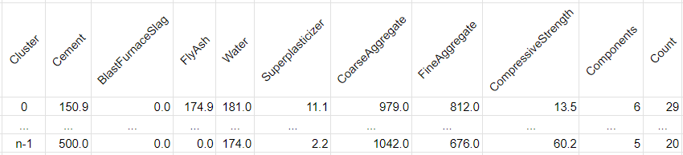

# goit-mlfund-hw-05

***Технiчний опис завдань***

## **Завдання 5: Домашнє завдання до модуля «Алгоритми навчання без вчителя»**

### **Цілі цього завдання:**

У цьому модулі ми досліджували основні задачі навчання без учителя, такі як кластеризація та зменшення розмірності даних, використовуючи два найпоширеніших методи: KMeans та PCA відповідно. Виявлення прихованих зв'язків між об'єктами даних шляхом їхнього групування в кластери може значно розширити наше розуміння набору даних.

Раніше в темі «Вступ до генерації ознак. Відбір ознак» ми працювали з набором даних про бетон (Concrete) та демонстрували прийоми feature engineering на його прикладі. У цьому домашньому завданні ви спробуєте знайти кластери в цьому наборі даних.

### **Покрокова інструкція виконання:**

1. Завантажте [набір даних Concrete](https://www.kaggle.com/datasets/prathamtripathi/regression-with-neural-networking), як це показано у розділі «Поширені прийоми генерації ознак. Математичні перетворення» теми «Вступ до генерації ознак. Відбір ознак»
2. Використайте прийом підрахунку кількості для створення нової ознаки `Components`, яка вказуватиме на кількість задіяних складових у різних рецептурах бетону
3. Нормалізуйте набір даних за допомогою об’єкта `StandardScaler` з пакета `sklearn` для подальшої кластеризації
4. Визначте оптимальну кількість кластерів за допомогою об'єкта `KElbowVisualizer` з пакета `yellowbrick`
5. Проведіть кластеризацію методом k-середніх і отримайте мітки для кількості кластерів, визначеної на попередньому кроці
6. Використайте оригінальний набір вхідних даних для розрахунку описової статистики кластерів («звіту»): розрахуйте медіани для кожної ознаки, включаючи підрахунок кількості компонент по кожному кластеру за допомогою методу `groupby`, описаному в розділі «Практика виконання EDA в Pandas. Операції GroupBy» теми «Дослідницький аналіз даних (EDA)»
7. Додайте до звіту кількість об'єктів (рецептур) у кожному з кластерів
8. Проаналізуйте звіт та зробіть висновки

### **Орієнтовний очікуваний результат:**

*Отримання додаткової інформації про об'єкти вхідного набору даних, яка сприятиме подальшому дослідженню та кращому розумінню факторів, які суттєво впливають на міцність бетону, у формі таблиці:*

### **Критерії прийняття ДЗ:**

1. **!Код виконується**
2. Завантажено набір даних
3. Створено нову ознаку шляхом підрахунку кількості
4. Нормалізовано набір даних
5. Визначено оптимальну кількість кластерів, проведено кластеризацію методом k-середніх і отримано мітки
6. Розраховано описову статистику кластерів, у т.ч. пораховано кількість об'єктів у кожному із кластерів
7. Досягнуто очікуваних результатів виконання
8. Зроблено відповідні висновки
9. Не порушено логіку і послідовність виконання етапів підготовки даних. Не пропущено суттєві етапи підготовки даних

## 🏗️ ДЗ №5: Кластеризація та міцність бетону (Concrete Strength)

### 🎯 Опис задачі

Комплексне дослідження рецептур бетону (Concrete Strength). Головна мета проекту полягає у виявленні прихованих хімічних патернів у складах сумішей за допомогою алгоритмів навчання без вчителя (KMeans кластеризація та PCA), а також у побудові високоточного регресора для прогнозування фінальної міцності бетону (Compressive Strength) за допомогою градієнтного бустингу.

---

### 🧮 Математичне ядро: Кластеризація, Зменшення розмірності та Бустинг

Для глибинного аналізу даних реалізовано багаторівневий математичний підхід:

**1. Алгоритм K-середніх (KMeans)**
Мінімізує суму квадратів відстаней від кожної точки (рецептури бетону) до центру її кластера. Алгоритм групує схожі рецептури, мінімізуючи функцію інерції (Distortion Score):

$$J = \sum_{j=1}^{k} \sum_{i \in C_j} ||x_i - \mu_j||^2$$

Для визначення математично оптимальної кількості кластерів $k$ застосовано метод "ліктя" (Elbow Method) через `KElbowVisualizer`.

**2. Аналіз головних компонент (PCA)**
Для 3D-візуалізації багатовимірного простору ознак використано PCA, який максимізує дисперсію проекцій даних. Метод знаходить власні вектори $v$ (головні компоненти) коваріаційної матриці $\Sigma$:

$$\Sigma v = \lambda v$$

де $\lambda$ — власні значення, що визначають частку поясненої дисперсії. Це дозволило спроектувати 8-вимірний хімічний склад у наочний тривимірний простір.

**3. Градієнтний Бустинг (XGBoost)**
Для прогнозування міцності бетону застосовано ансамбль, який будує дерева послідовно, мінімізуючи функцію втрат $L$ на кожному кроці $t$:

$$obj^{(t)} = \sum_{i=1}^n L(y_i, \hat{y}_i^{(t-1)} + f_t(x_i)) + \Omega(f_t)$$

де $\Omega(f_t)$ — регуляризаційний термін, що жорстко захищає модель від перенавчання (Overfitting).

---

### 🧪 Квантова пояснюваність та Симуляція (TimesFM)

Проект інтегрує сучасні підходи до пояснення та симуляції хімічних процесів:

**1. Аналіз векторів Шеплі (SHAP)**
Для подолання проблеми "чорної скриньки" XGBoost використано `shap.TreeExplainer`. Він розраховує маргінальний внесок кожного інгредієнта (наприклад, цементу чи води) у підсумкову міцність бетону на основі теорії кооперативних ігор:

$$\phi_i(x) = \sum_{S \subseteq F \setminus \{i\}} \frac{|S|! (|F| - |S| - 1)!}{|F|!} \left[ f_x(S \cup \{i\}) - f_x(S) \right]$$

**2. Симуляція набору міцності (TimesFM)**
В якості індустріального енкору використано фундаментальну модель **Google TimesFM** (Zero-Shot). Вона симулює криву набору міцності (Curing Curve) у часі (дні затвердіння бетону), виявляючи логарифмічний тренд твердіння без жодного додаткового донавчання на цьому наборі даних.

---

### 🚀 Advanced MLOps (Production Ready)

- **Інтерактивне середовище (Marimo):** Весь пайплайн реалізовано як реактивний застосунок. Завдяки повзункам, зміна кількості кластерів `K` миттєво перебудовує радарні діаграми, 3D PCA графіки та описову статистику.
- **Байєсівська оптимізація:** Підбір гіперпараметрів для регресорів здійснюється через фреймворк Optuna з паралельним логуванням усіх експериментів у `MLflow`.
- **Автоматична генерація API (FastAPI):** Замість ізольованих скриптів, пайплайн динамічно генерує production-ready мікросервіс `api.py` із суворими Pydantic-контрактами для розгортання моделі на заводських серверах.

---

### 📊 Результати та Висновки

- **Структуризація даних:** Використовуючи Elbow Method, ми математично підтвердили наявність оптимальних угруповань рецептур. Створена нами нова ознака `Components` (підрахунок кількості задіяних інгредієнтів) додала інформативності алгоритму кластеризації.
- **Профілювання кластерів:** Радарні діаграми чітко візуалізували хімічний профіль кожного кластера, відділивши "бюджетні" суміші (багато води, мало цементу) від високотехнологічних бетонів (із застосуванням суперпластифікаторів та доменного шлаку).
- **Бенчмаркінг Регресорів:** Промисловий стандарт XGBoost та еталонний HistGradientBoosting від Scikit-Learn показали феноменальні результати ($R^2 > 0.90$), довівши домінацію бустингу у виявленні нелінійних хімічних залежностей порівняно з базовими моделями.
- **SHAP-Аналітика:** Аналіз бджолиного рою статистично підтвердив фундаментальні закони бетонознавства: додавання води катастрофічно знижує міцність (зсув точок вліво), тоді як високий вміст цементу та довший час твердіння (`Age`) є найпотужнішими драйверами міцності.

---

### 📊 Висновки (Академічні вимоги vs Production)

В рамках базових академічних вимог завдання виконано у повному обсязі: завантажено набір даних `Concrete`, застосовано `StandardScaler`, визначено оптимальне $K$ за допомогою `KElbowVisualizer`, проведено кластеризацію `KMeans` та обчислено описову статистику (медіани) для кожного кластера через операцію `groupby`.

**Проте, для досягнення індустріальних стандартів (Production), архітектуру було масштабовано:**

1. **Багатовимірна візуалізація:** Впроваджено 3D PCA-простір та "Хімічний радар" (Radar Charts) для глибокого розуміння природи знайдених кластерів.
2. **Перехід до Supervised Learning:** Додано пайплайн градієнтного бустингу (XGBoost), який дозволяє не лише групувати дані, а й прогнозувати точну марку міцності суміші.
3. **Прозорість (XAI):** Додано графік SHAP, який наочно пояснює вплив кожного окремого компонента суміші на фінальну якість продукту.
4. **MLOps мікросервіс:** Проект генерує готові артефакти (`champion.joblib`, `api.py`), дозволяючи за лічені секунди розгорнути натреновану модель у Docker-контейнері як незалежний FastAPI-сервіс для IoT-інтеграції на виробництві.
